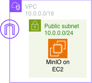
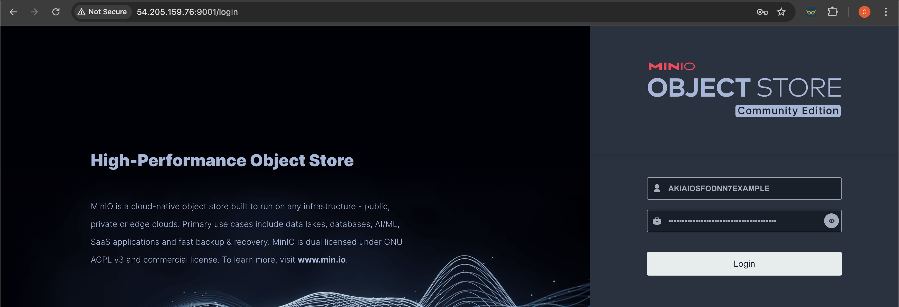
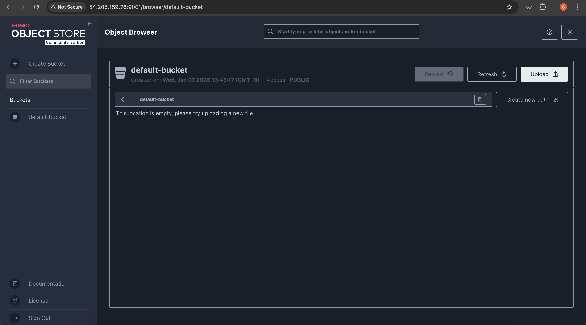
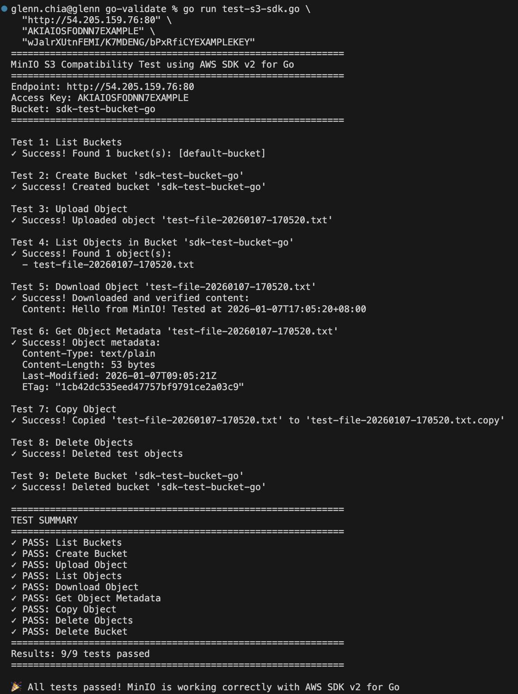

# External S3 - MinIO S3

# 1. Architecture



# 2. Deployment

Step 1: Copy [terraform.tfvars.example](./tf/terraform.tfvars.example) to `terraform.tfvars` and adjust the variables accordingly.

Step 2: In [tf](./tf/) run `terraform init` and `terraform apply --auto-approve`. Note the outputs that will be used to connect to the console.

# 3. Verify

Step 1: View login page on HTTP port 80



Step 2: Login and view home page



# 4. Testing

In [go-validate](./go-validate/) run `go mod tidy` and then run the tests

```bash
go run test-s3-sdk.go \
  "http://PUBLIC_IP:80" \
  "ACCESS_KEY" \
  "SECRET_ACCESS_KEY"
```


